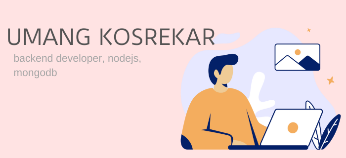

👋 Hi there! I’m Umang Kosrekar  
🔭 Currently working on backend projects  
🌱 Learning new technologies and concepts  
💬 Feel free to ask me about backend development  
🚀 Open to collaboration on exciting projects!  

## 🌐 Socials:

 

# 💻 Tech Stack:

# 📊 GitHub Stats:

  

## 🏆 GitHub Trophies

### 🧐 Did You Know?

---

<!-- Proudly created with GPRM ( https://gprm.itsvg.in ) -->

#### Keep learning and stay curious.
